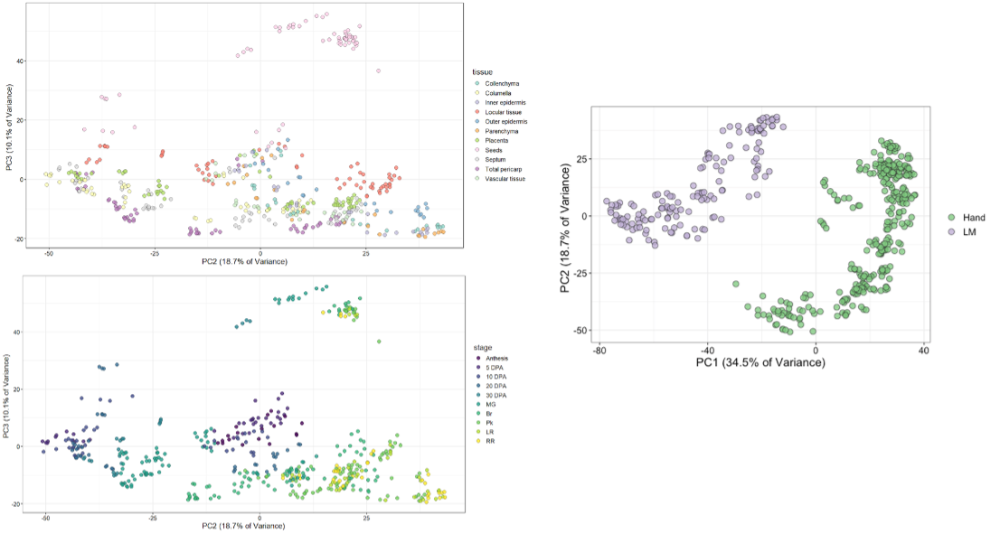
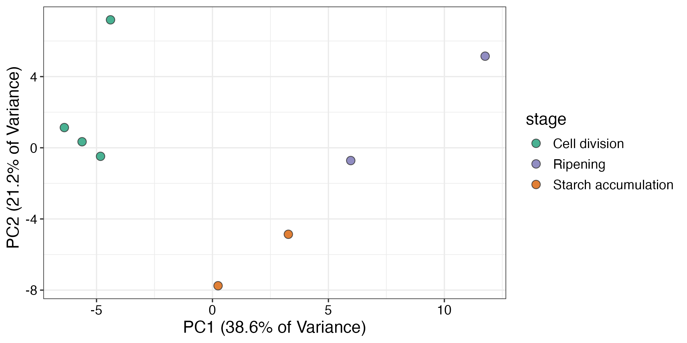
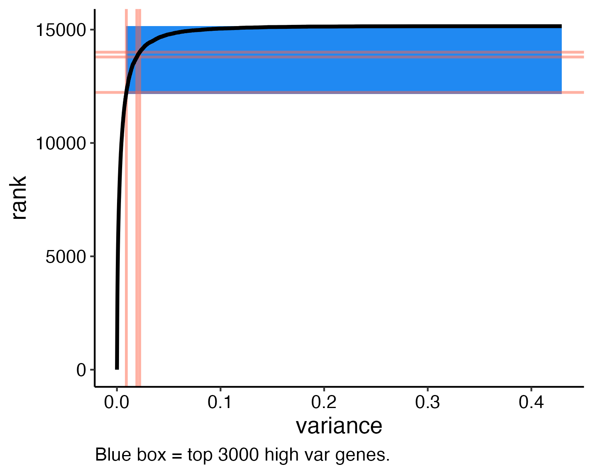
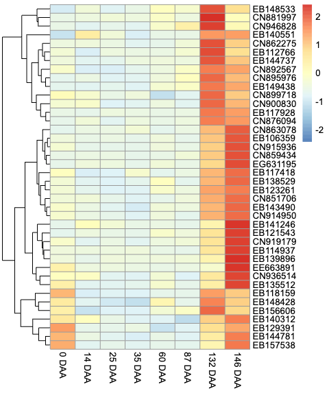
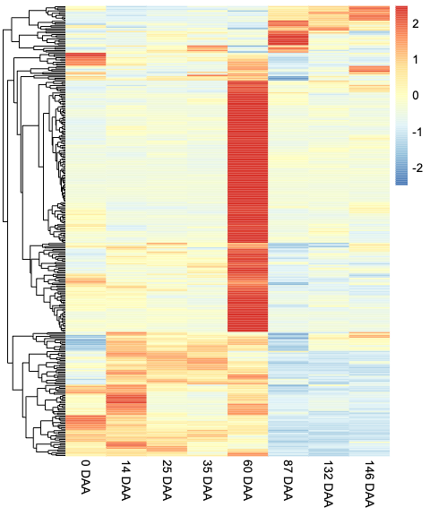
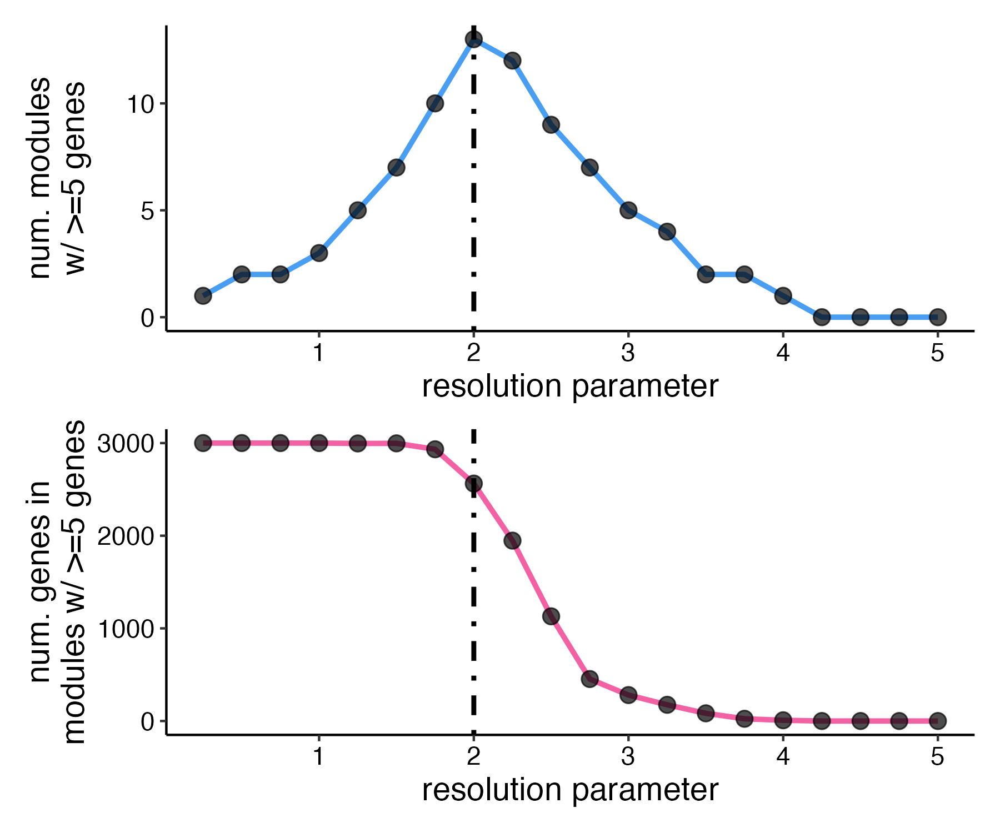
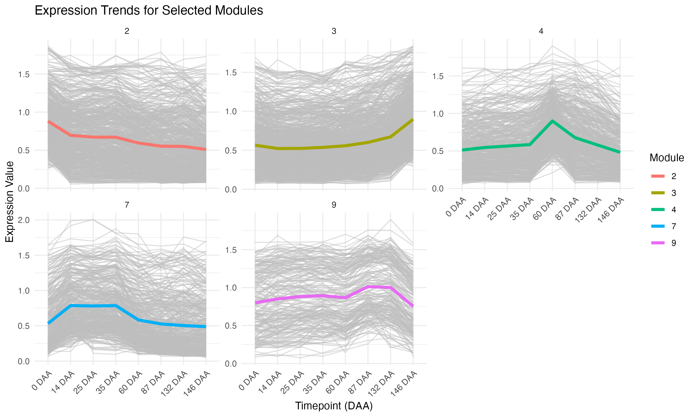

# Co-expression analysis of plant development genes

## Abstract:

  The need to understand the patterns by which differences in gene expression drive plant development is crucial for identifying key regulatory pathways that can aid in agricultural progress. Li et al. developed a gene co-expression analysis workflow that uses RNA sequencing data to construct networks of genes with similar expression trends to pin down these pathways. Our group was able to test this proposed analysis on different datasets and with different genes. Using the step by step instructions laid out by the github provided by Li et. al, we applied the R workflow to the Janssen et. al dataset for apple development, as well as the same Shinozaki et. al used in the Li et.al paper where we tested both the same bait genes and two random bait genes. It was determined that this workflow was able to be applied to different datasets and was able to successfully analyze the coexpression of different genes. Thus, our project validated existing co-expression analysis techniques, provided new insights into the genetic regulation of plant development across multiple species, and reinforces our proficiency in bioinformatics analysis.

## Introduction / Background

Per the USDA, food waste contributes on average 58% of landfill methane emissions. Thus, food waste has become an increasingly prevalent issue from its consequent contribution to global warming therefore, it is imperative to find new ways to keep our produce fresher longer and optimize their quality. In recent years, measuring gene expression has become increasingly important for uncovering the genetic mechanisms that drive plant development.

The most common technique used to measure gene expression is through RNA sequencing, which quantifies the number of occurrences of each RNA transcript in the sample. These produce massive datasets that are difficult to comb through by hand, so many computational tools are used to visualize this data so it can be interpreted in a meaningful way.  Li et al. constructed a gene co-expression analysis workflow which uses RNA sequencing data to identify networks of genes with similar expression. Utilizing bait genes, which are known regulatory genes, they were able to identify other genes based on their expression patterns. Once identified, these could be further tested by others to quantify their function on fruit ripening patterns. 

Our goal was to recreate figure 2B from the Li et al. paper using the original data and bait genes, original data and two random bait genes, and to use a new data set to explore the analysis workflow functionality and provide new insights into the genetic regulation of plant development across different species. Testing these different genes and different datasets would be a test of how this workflow can be applied to RNA sequencing data to examine the coexpression of genes.

## Aims

- Adapt downstream analytical strategies from an experimental design perspective.
- Construct co-expression networks and categorize gene modules with similar expression trends through cluster analysis.
- Verify the workflow in R can be successfully performed with other genes.
- Employ the workflow to analyze data sets from other plants.

## Data sources and computational method

  R Studio and its packages tidyverse, igraph, ggraph, readxl, patchwork, RcolorBrewer, and viridis were used to read in files, produce the graphs, and supporting data for this project. The data sets were obtained from the Shinozaki et.al or Janssen et.al papers. The metadata sets were downloaded from the NIH SRA website under the Accession number SRP109982 for the Shinozaki data while the Janssen metadata was found via the [NIH website](https://www.ncbi.nlm.nih.gov/sra) by searching the accession number in the SRA section and were download using the Run Selector function. The exact code followed for this recreation was found on [github](https://github.com/cxli233/SimpleTidy_GeneCoEx?tab=readme-ov-file#metadata) provided by Li et. al. ChatGPT was used to troubleshoot code when it was not working.
 

## Result

### Recreation

One of the first steps in the Li et. al workflow was to recreate three PCA plots (Fig. 1). Though these plots would be identical to those posted by Li. et al, these serve to verify that the data loaded properly into our R Markdown. Similarly, in comparing the PCA plots obtained from this recreation we confirmed that the correct files were downloaded and loaded into R and were readable.  PCA plots based on technique of dissection (Laser microdissection=LM, by hand=Hand) which showed the method was a major source of variance in PC1. For PC2 and PC3 we performed PCA to look at the biological significance stage and tissue.

**Figure 1:** Above are the PCA plots showing the variance in gene expression based on tissue (top), developmental stages (bottom), and the method of collecting samples (right).

Next, the z-score for the dataset was calculated to quantify differences in expression and standardize the data. Genes were selected for high expression based on z-score. From the high expression genes two random genes were selected to be the alternative bait genes. These genes were identified in the data set as Solly.M82.08G013600.3 (Gene 1)  and Solly.M82.01G023870.1 (Gene 2). The actual role of these genes is unknown, but they are simply a marker to see how this workflow applies to analyzing other genes in the same dataset. The z-scores of the both sets of bait genes were plotted for the sample for both the developmental stages of the sample and the tissue of the sample (Fig. 2). The plot for the original bait genes was more tightly clustered, while the random bait genes are more sporadically spread out. This could indicate coexpression of the original bait genes, but not of the random bait genes.

**Figure 2:** The z-scores of the alternative bait genes were plotted against each other examining the expression in samples for both the developmental stages (top left) and tissue type (top right). The original plots were recreated with the original bait genes. The z-scores of PG was plotted against the z-scores of PSY1 to show the variance in expression in different samples for the different developmental stages (bottom left) and the different tissue types (bottom right).

The correlation coefficients were calculated using an edge table. The r values were plotted and a cut off was determined based on where the values start to drop off (Fig. 3). The cutoff selected was r>0.7, for the given bait genes. However, the dropoff happens earlier with the random genes, so the cut off would likely be lowered. For comparison’s sake the red line is in the same position for both the random genes and the bait genes.

**Figure 3.** P value cutoffs  and corresponding r value for the random bait genes (left) and provided bait genes (right). Bait genes determine the cutoff if the genes are involved in the same process or are co-expressed. If experiments have a larger df then it produces smaller p values which can skew the results.

Next was creating the modules. In order to make this process easier it is important to determine the resolution.  Resolution that is too low would make all of the genes in one module. The resolution being too high would mean that the modules would be too small and most genes would be on their own. By plotting the number of modules with 5 or more genes against resolution parameters (blue graph) and the number of genes in modules with 5 or more genes against resolution parameters (red graph) (Fig. 4), the optimal resolution was determined to be 2. This is because it lies in the range where both graphs are stable.

**Figure 4.** Module number vs. genes retained. Showcases modules that are interconnected by also looking at the resolution. Low resolution puts genes with different expressions into the same cluster but too high leads to less clustering and loss of potential correlation.

These modules or clusters of genes are compared by plotting the z-scores of the clusters against the different stages of development (Fig. 5). Module 1 is a grouping of genes that is expressed earlier in each of the different tissues. This is clear by the black line in the top row of Figure 5  having a z-score approaching zero after the 5 DPA developmental stage. However, module 5 is a group of genes that is expressed later in development, this is shown by the black line in the bottom row of Figure 5 increasing through different stages of development in each of the different tissue types. These graphs are important in demonstrating the variance in gene expression of the different modules of genes. There are more than 5 modules, but these are examples to illustrate the differences in said modules.

**Figure 5.** The z-score values for module 1 and module 5 plotted against different developmental stages for each of the different tissue types. The black line that overlays gray reflects the average z-score values of the module with the gray lines each reflecting the z-score of the individual genes in the module.

### Using alternative dataset

We also want to know whether the workflow also worked for another Malus domestica (apple) dataset. 

{#id .class width=70% height=70%}

**Figure 6.** Principle Components Analysis results for each timepoint.

The PCA results here (Fig. 6) present a clear identification by PC1 axis for time point order.

As the paper did not offer a expression dataset based on actual genes and there's lack of probes to the genes mapping, it's hard to get the bait genes to guid the exploratory process of the study.

However, the paper provide three core cell cycle genes, which are:
- EB107042: CDKB1;2 homologue,
- CN943384: CDKB2;2 homologue,
- EB141951: CKS1 homologue

We employed those genes as our bait genes.

{#id .class width=70% height=70%}

**Figure 7.** Variance against rank. Blue box: top 3000 high variance genes. Red lines: bait genes.

Both the subjective and objective way for high variance genes and edge selection concludes the correlation between the pre-selected bait genes (Fig. 7). 

DGE analysis between time points filters out a set of genes that could potentially be involved in the ripening stage and starch accumulation stage (Fig. 8 & 9). 

{#id .class width=70% height=70%}

**Figure 8.** Heatmap result for differential gene expression (DGE) analysis for 35 Days After Anthesis (DAA), 87 DAA vs 135 DAA.

{#id .class width=70% height=70%}

**Figure 9.** Heatmap result for differential gene expression (DGE) analysis for 60 DAA vs 87 DAA.

The module assignment based on the cluster_leiden can allocate the genes under resolution=2 (Fig. 10). Genes with similar trends are clustered to the same module in this case (Fig. 11).

{#id .class width=70% height=70%}

**Figure 10.** Determination of resolution parameter for cluster leiden.

{#id .class width=70% height=70%}

**Figure 11.** Expression trends for genes in top 5 modules with the most gene.

Finally, the filtered genes are significantly enriched in a certain module (Supplementary file).

## Discussion

Regarding the reproduction part, we have done a good job and met our expectation. For the future work, we can focus on how to construct co-expression networks and further reproduce the construction of sub-networks for different stages under different classifications.

Compared to reproduction, the analysis of other datasets is more problematic. The most critical point lies in the source of the datasets. The expression cassettes provided by the reference article are not at the actual gene level, nor are the raw data; they are based on ESTs (probes) level expression data. The expression values at each time point are the averages of specific technical replicates, providing only the average values and sample quantities, while lacking the original individual expression values and specific replication measurement information. This has limited me to taking logarithmic transformations of single expression values when performing the normalization process, rather than z-scores, etc.. This may amplify changes in low expression genes. At the same time, due to technical issues, a lot data values at many time points are NA. I used an exclusion strategy, which led me to approximately ignore about 5% of the tags. 

Additionally, the type of metadata is relatively single, consisting only of time points, which cannot reflect environmental conditions, experimental batches, or individual differences between samples. The fixed time points also result in the inability to capture potential dynamic changes, such as significant changes in key transcription factors or metabolic pathways between two sampling points, which are ignored in the current data.

Furthermore, since the expression values have been averaged, they may mask variability or noise information within the data, especially in differential expression analysis, where it is impossible to assess the contributions of technical errors and biological variations. Additionally, after module division, due to the lack of mapping between ESTs and genes, methods such as functional annotation and pathway analysis are greatly restricted. This makes the study not only stays exploratory levels but also lacks sufficient explanatory power, making it difficult to further reveal the biological significance of the modules or their regulatory roles in specific developmental stages.

## Conclusions

The recreation and utilization of the analyses was successful and we were able to produce more of the figures than expected. When examining the two sets of bait genes, there were some differences which are to be expected. The original bait genes are known to be coexpressed, but the alternative bait genes are simply random genes that are highly variable. This shows the reliability of this workflow to illustrate the coexpression of two genes, or lack thereof. Demonstrating how generally applicable and unbiased this workflow is to interpreting coexpression data in RNA sequencing data. Furthermore, this workflow can be done with an additional dataset. Though there were some challenges, this workflow was able to be followed. The apple dataset is considerably older and had some flaws, but the workflow was successful.

## Author Contributions

Sarah Bayne: Worked with the Shinozaki et. al dataset and the original bait genes, helped write the written report, organized slides.

Felix Li: Worked with the alternative Janssen et. al dataset apple dataset, helped write the written report in R Markdown, made results slides for the apple dataset.

Audrey Long: Worked with Shimadzu et. al dataset and random bait genes, helped write the written report, organized results figures on the presentation.

## References

Janssen, Bart J, et al. “Global Gene Expression Analysis of Apple Fruit Development from the Floral Bud to Ripe Fruit - BMC Plant Biology.” SpringerLink, BioMed Central, 17 Feb. 2008, link.springer.com/article/10.1186/1471-2229-8-16#additional-information.

Li, C., Deans, N. C., & Buell, C. R. (2023). “Simple tidy genecoex”: A gene co‐expression analysis workflow powered by Tidyverse and graph‐based clustering in R. The Plant Genome, 16(2). https://doi.org/10.1002/tpg2.20323

National Strategy for Reducing Food Loss and Waste And, www.usda.gov/sites/default/files/documents/NATIONAL-STRATEGY-FOR-REDUCING-FOOD-LOSS-AND-WASTE-AND-RECYCLING-ORGANICS.pdf. Accessed 2 Dec. 2024. 

Shinozaki, Y., Nicolas, P., Fernandez-Pozo, N., Ma, Q., Evanich, D. J., Shi, Y., Xu, Y., Zheng, Y., Snyder, S. I., Martin, L. B., Ruiz-May, E., Thannhauser, T. W., Chen, K., Domozych, D. S., Catalá, C., Fei, Z., Mueller, L. A., Giovannoni, J. J., & Rose, J. K. (2018). High-resolution spatiotemporal transcriptome mapping of tomato fruit development and ripening. Nature Communications, 9(1). https://doi.org/10.1038/s41467-017-02782-9 

## Supplementary material

Codes for processing alternative dataset backup can be found:

[LumiaSword / biostat_project](https://github.com/LumiaSword/biostat_project/blob/main/presentation_project.Rmd)
